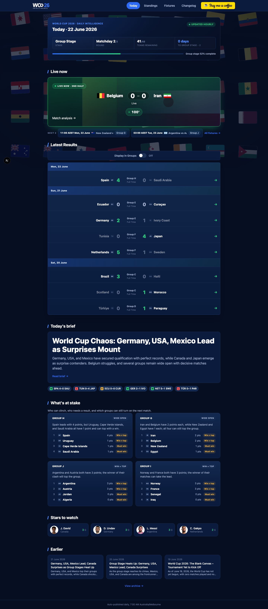
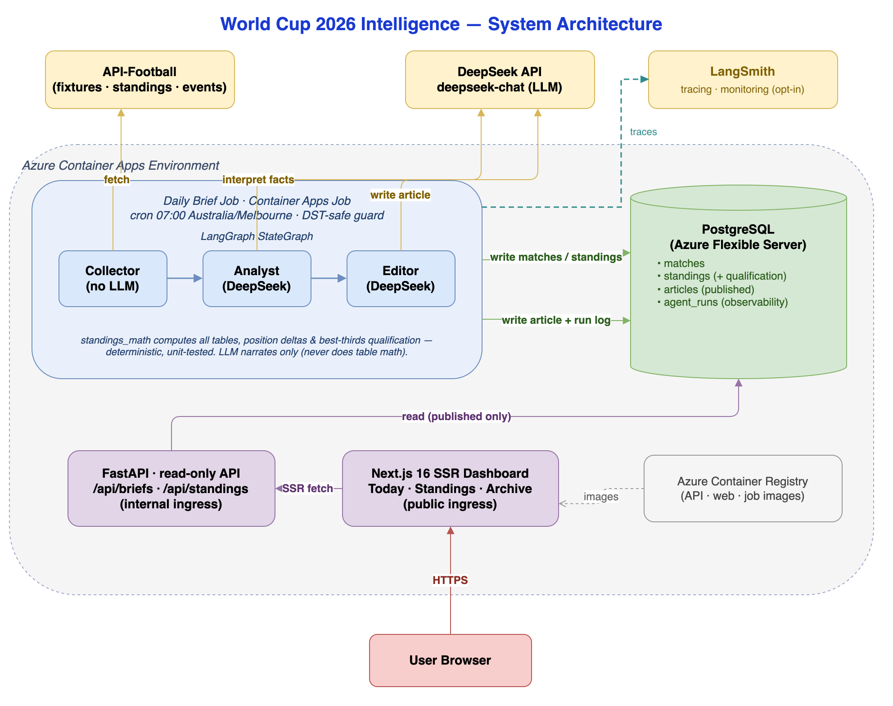

# World Cup Intelligence

Hourly AI-generated FIFA WC 2026 intelligence pipeline.

**Live:** https://wc2026.phucsystemlabs.com

## Screenshots

**Today** — AI-generated daily brief, live match, latest results, and what's at stake:



## Architecture



A **scheduler** container runs a **LangGraph** pipeline (`Collector → Analyst → Editor`) on an interval. The Collector pulls fixtures/standings from **API-Football** and computes all tables, position deltas, and best-thirds qualification deterministically in `standings_math` (unit-tested); the **DeepSeek** LLM only narrates the pre-computed facts. Results persist to **PostgreSQL**; the article is published only after the Editor succeeds (keep-last-good). A read-only **FastAPI** serves briefs/standings to the **Next.js 16 SSR** dashboard.

Pipeline runs are observable two ways: every run records timings, tokens, and cost to the `agent_runs` table (surfaced at `/logs`), and — when `LANGSMITH_TRACING` is enabled — full LLM traces stream to **LangSmith** for live monitoring. Tracing is off by default; see [`docs/deployment-guide.md`](docs/deployment-guide.md) §6.5.

The whole stack runs as one `docker-compose` deployment on a single Azure VM behind Caddy (TLS). See [docs/deployment.md](docs/deployment.md).

> Editable source: [`docs/diagrams/architecture.drawio`](docs/diagrams/architecture.drawio) (open in [draw.io](https://app.diagrams.net)) · also available as [SVG](docs/diagrams/architecture.svg).

## Prerequisites

- Docker + Docker Compose v2+
- [uv](https://docs.astral.sh/uv/) (Python package manager)
- Node.js 20+ / npm

## Local Setup

### Current Runnable Mode

Use this mode today. It matches the current repo: Postgres, FastAPI, and Next.js.

### 1. Environment

```bash
cp .env.example .env
# Fill in API_FOOTBALL_KEY and DEEPSEEK_API_KEY
```

### 2. Start Postgres

```bash
docker compose up -d postgres
```

### 3. Run migrations

```bash
cd backend
DATABASE_URL=postgresql+psycopg://wc:wc@localhost:5432/worldcup uv run alembic -c db/alembic.ini upgrade head
```

### 4. Start backend (local)

```bash
cd backend
uv run uvicorn app.main:app --reload
# http://localhost:8000/health
```

### 5. Start frontend

```bash
cd frontend
npm install
npm run dev
# http://localhost:3000
```

### 6. Full stack via Docker Compose (one command)

Runs the entire stack — Postgres, migrations + seed, the API, and the SSR frontend:

```bash
docker compose up --build
```

Service startup is ordered automatically:
`postgres` (healthcheck) → `migrate` (alembic upgrade + seed the 12-group skeleton, then exits) → `backend` (healthcheck) → `frontend`.

Then open:
- Frontend: http://localhost:3000
- API: http://localhost:8000/health · http://localhost:8000/api/standings

The frontend (SSR) reaches the API over the compose network via `API_BASE=http://backend:8000` — no host config needed.

**Hot reload (HMR) in Docker:** the compose dev frontend bind-mounts `./frontend`
and runs `next dev --webpack` with `WATCHPACK_POLLING` (see `frontend/Dockerfile`
`dev` stage). Polling is used because Turbopack's native file watcher doesn't
receive change events across the macOS/Windows Docker filesystem. Edits to
`frontend/` recompile live — no container restart needed. After changing the
Dockerfile/compose dev config itself, rebuild the image once:
`docker compose up -d --build frontend`. (Native `cd frontend && npm run dev`
stays on Turbopack and is still the fastest loop.)

**Optional API keys** (for live data + brief generation): create `.env` at the repo root with `API_FOOTBALL_KEY` and `DEEPSEEK_API_KEY`; compose passes them to the `backend` service. Without them, the site still runs and shows the seeded standings (briefs list stays empty).

**Real data:** the project runs on a paid API-Football plan, so season 2026 (the live World Cup) — including match statistics like xG, shots, and possession — is available directly; the default `API_FOOTBALL_SEASON=2026` works as-is. On a free plan (which covers 2021–2023 only and omits some statistics), set `API_FOOTBALL_SEASON=2022` in `.env` to populate the DB with the real Qatar 2022 World Cup (64 matches, 8 groups) instead. Either way, trigger a collect:

```bash
docker compose exec backend python -m app.data.collect --date $(date +%F)
# or: curl -X POST http://localhost:8000/api/admin/collect
```

The collector pulls group membership from the standings endpoint, counts only group-stage matches toward the tables, and computes all standings deterministically in Python.

**Generate a brief inside the running stack:**

```bash
# Fetches fresh data (collector) AND generates the brief in one step.
docker compose exec backend python -m app.pipeline.run --date 2026-06-19
```

`pipeline.run` (and the scheduled job) runs the collector first, then the brief. If the API key is missing or the fetch fails, it logs a warning and proceeds with whatever data is already in the DB rather than skipping the brief. To backfill data without generating a brief, run the collector alone:

```bash
docker compose exec backend python -m app.data.collect --date 2026-06-19
```

**HTTP triggers (local/dev only — unauthenticated):**

The backend also exposes two POST endpoints to trigger work over HTTP (handy for a local scheduler/webhook). They default to today's date in `BRIEF_TIMEZONE`; pass `?date=YYYY-MM-DD` to override.

```bash
# Collect data only (no LLM cost)
curl -X POST http://localhost:8000/api/admin/collect

# Full pipeline: collect -> generate + publish brief
curl -X POST "http://localhost:8000/api/admin/run-brief?date=2026-06-20"
```

> ⚠️ These endpoints write data and spend API-Football quota + DeepSeek tokens, and have **no authentication**. They are for local/dev use. Do **not** expose them on a public ingress without adding auth.

Reset everything (including the DB volume):

```bash
docker compose down -v
```

## Tests

```bash
cd backend
uv run pytest
```

## Project Structure

```
backend/     FastAPI app, pipeline, data collectors
frontend/    Next.js + Tailwind dashboard
db/          Alembic migrations (inside backend/)
infra/       VM provisioning + ops scripts (provision, seed, backup, cost)
```

## Deploy

The app deploys as the existing `docker-compose` stack on a single Azure VM
(Caddy TLS, GHCR images built in CI, backend/Postgres internal-only). Provisioning
and ops scripts live in `infra/`.

**Full runbook: [docs/deployment.md](docs/deployment.md).** Never commit secrets — app
keys live in the VM `.env`; deploy keys are GitHub Actions secrets.
