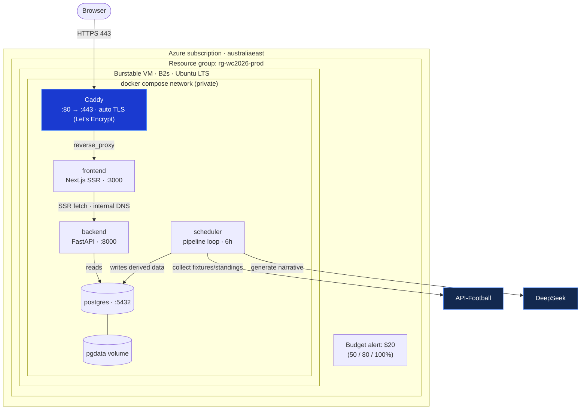
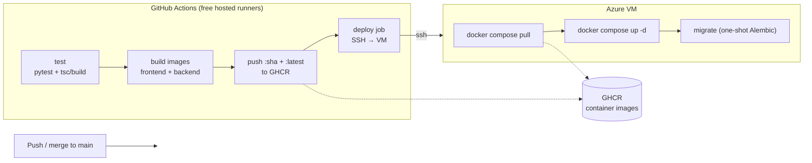

> **Execution status (2026-06-21):** Repo phases **1, 2, 4, 7 — DONE** (committed artifacts:
> `docker-compose.prod.yml`, `docker-compose.override.yml`, `Caddyfile`, rewritten
> `.github/workflows/deploy.yml` with JIT-NSG SSH, `infra/*.sh` + `cloud-init.yaml`,
> `docs/deployment.md`; legacy bicep/docs removed). Operator phases **0, 3, 5, 6** are
> **scripted but pending execution** (need `az login` / DNS / SSH / keys). The CI deploy
> opens the runner IP on the NSG just-in-time, so SSH stays locked to the operator IP.

# Low-Cost Azure VM Deployment

Deploy the app **as-is** (no re-architecture) on a **single Azure burstable VM** running the existing
`docker-compose` stack, fronted by Caddy for TLS. Cheapest shape that ships what already works.

## Brainstorm consensus (decisions)

| # | Decision | Rationale |
|---|---|---|
| D1 | **Single VM**, all containers (postgres + backend + scheduler + Next SSR) | One box = the whole bill; no managed services to pay for |
| D2 | **Self-host Postgres** on the VM (volume), not Azure DB for PostgreSQL | DB holds *derived* data (standings/briefs), regenerable from API-Football + a pipeline re-run — it's a cache, not a system of record. Saves ~$12–15/mo |
| D3 | **Frontend stays Next.js SSR** (no static export, no refactor) | "Static FE" would require converting SSR server-component fetches to client-side + CORS. Out of scope per "no re-architecture" |
| D4 | **Only the frontend is public**; backend + Postgres stay on the internal docker network | Verified: zero client-side API calls (all `lib/api` usage is server-side SSR; client components import types only). No CORS, smaller attack surface |
| D5 | **Caddy** reverse proxy for automatic Let's Encrypt TLS, single origin | Free, one config file, no paid gateway/LB |
| D6 | **Dial down the scheduler interval** (e.g. 30 min → 6 h) | The real variable cost is DeepSeek tokens + API-Football quota from hourly runs, not Azure infra |
| D7 | **No App Insights / Front Door / CDN / ACR**; journald + docker logs + free uptime ping + $20 budget alert | Observability stacks meter and add up |
| D8 | **Deallocate the VM off-window**; consider Spot | World Cup is a fixed window — don't pay 24/7/365 |
| D9 | **GitHub Actions CI/CD**: build images on GH-hosted runners → push to **GHCR** → deploy to VM over **SSH** (`docker compose pull && up -d`) | Builds happen on free runners, so the VM never builds → it can stay **B1ms (2 GB)**. No registry cost (GHCR), no extra always-on infra |

### Resolved: build + deploy mechanism
GitHub Actions is the CI/CD. Images are **built in CI and pulled by the VM** — the VM only runs containers, so **B1ms (2 GB) + small swap** is sufficient (no on-VM builds). GHCR hosts the images (free for public; a read-only PAT or public images avoids VM login). This replaces the legacy `.github/workflows/deploy.yml` (Container Apps).

## Deployment diagram



**Public surface = Caddy (:443) only.** `backend` (:8000) and `postgres` (:5432) have **no host port mappings** in prod — reachable only inside the docker network. The browser never calls the backend (all `lib/api` access is server-side SSR), so there is no CORS and no public API surface. `scheduler` runs the pipeline module directly against Postgres + external APIs; `migrate` (one-shot, not shown) runs Alembic on startup.

## CI/CD pipeline (GitHub Actions)



**Flow:** `main` push → **test** (backend `pytest`, frontend `tsc`/build) → **build** frontend + backend images → **push** to GHCR tagged `:<sha>` and `:latest` → **deploy** job SSHes to the VM and runs `docker compose -f docker-compose.yml -f docker-compose.prod.yml pull && up -d` (compose references the GHCR images). PRs run **test only** (no deploy).

**Required GitHub secrets:** `SSH_HOST`, `SSH_USER`, `SSH_PRIVATE_KEY` (deploy), and — only if GHCR images are private — a `GHCR_PAT` the VM uses to `docker login ghcr.io`. App secrets (`API_FOOTBALL_KEY`, `DEEPSEEK_API_KEY`) live in the VM `.env`, **not** in CI.

## Rough monthly cost (tournament, always-on)

| Item | Cost |
|---|---:|
| B1ms VM (PAYG, runs-only — CI builds) — or Spot ~$5–8 | ~$15 |
| OS disk 30 GB Standard SSD | ~$2–3 |
| Self-hosted Postgres / logs / egress | ~$0 |
| GitHub Actions + GHCR (public repo) | ~$0 |
| **Azure infra** | **~$15–18** |
| DeepSeek tokens | = f(scheduler interval) ← main lever |
| API-Football plan | separate quota |

---

## Phases

### Phase 0 — Prerequisites (no code)
- Azure subscription + `az login`; pick region (`australiaeast`).
- A DNS name pointing at the VM (real domain, or free `*.nip.io`/`*.sslip.io` against the public IP) — **required for Caddy/Let's Encrypt**.
- Keys ready: `API_FOOTBALL_KEY`, `DEEPSEEK_API_KEY`.
- **Acceptance:** `az account show` works; domain/IP plan chosen.

### Phase 1 — Production compose overlay + Caddy (repo)
Create files (new; no app code touched):
- `docker-compose.prod.yml` — overlay that:
  - replaces `build:` with `image: ghcr.io/<owner>/wc2026-{frontend,backend}:latest` on `frontend`, `backend`, `migrate`, `scheduler` (CI builds; VM pulls — no on-VM build).
  - adds `caddy` service (`ports: 80:80, 443:443`; volumes for `caddy_data`, `caddy_config`; mounts `Caddyfile`).
  - **removes host port mappings** from `backend` (8000) and `postgres` (5432) — keep them internal only.
  - drops `frontend` host port (Caddy proxies `frontend:3000`).
  - adds `restart: unless-stopped` to postgres, backend, frontend.
  - reads `SCHEDULER_INTERVAL_SECONDS` from env (Phase 2).
- `Caddyfile`:
  ```
  your.domain {
      reverse_proxy frontend:3000
  }
  ```
  (Single origin; backend reached server-side via internal DNS, so no `/api` rule needed.)
- **Acceptance:** `docker compose -f docker-compose.yml -f docker-compose.prod.yml config` validates; locally, `https`/proxy reaches the frontend; `curl` to host:8000 / :5432 refused.
- **Risk:** Caddy needs a resolvable domain for TLS — confirm Phase 0 DNS first. For pure local testing use Caddy `tls internal`.

### Phase 2 — Cost knobs + secrets (config only)
- Set scheduler frequency in prod env: `SCHEDULER_INTERVAL_SECONDS=21600` (6 h) — tune to match-day cadence.
- VM `.env` (NOT committed) holds `API_FOOTBALL_KEY`, `DEEPSEEK_API_KEY`, `SCHEDULER_INTERVAL_SECONDS`, `BRIEF_TIMEZONE=Australia/Melbourne`.
- Set a hard spend cap in the DeepSeek dashboard.
- **Acceptance:** scheduler logs show one run per interval; `.env` is git-ignored.
- **Risk:** confirm the pipeline skips/cheapens the LLM call when match data is unchanged (idempotent re-runs) — if not, lower frequency further.

### Phase 3 — Provision the VM (Azure CLI)
- `az group create` → `rg-wc2026-prod`.
- `az vm create`: Ubuntu LTS, **B1ms** (CI builds, so the VM only runs), Standard SSD 30 GB, SSH key, optional `--priority Spot --eviction-policy Deallocate`.
- NSG: allow `22` from your IP / GitHub deploy step, `80`/`443` from anywhere. **Do not** open 8000/5432.
- Install Docker Engine + compose plugin; add a 1 GB swap file (headroom — no builds run here).
- **Acceptance:** SSH in; `docker run hello-world`; ports 80/443 reachable, 8000/5432 not.

### Phase 4 — CI/CD pipeline + first deploy (GitHub Actions)
- Add `.github/workflows/deploy.yml` (new — **replaces** the legacy Container Apps one): jobs `test` → `build-push` (GHCR, `:<sha>`+`:latest`) → `deploy` (SSH: `docker compose -f docker-compose.yml -f docker-compose.prod.yml pull && up -d`). PRs run `test` only.
- Add GitHub secrets: `SSH_HOST`, `SSH_USER`, `SSH_PRIVATE_KEY` (+ `GHCR_PAT` if images private).
- **Bootstrap (one-time on VM):** clone repo, drop `.env`, `docker login ghcr.io` (if private), then trigger the workflow (or run `pull && up -d` manually for the first boot). `migrate` runs Alembic once; then backend/scheduler/frontend/caddy start.
- **Acceptance:** a push to `main` builds → pushes to GHCR → SSH-deploys; `https://your.domain` serves the app with a valid cert; re-running the workflow rolls the VM to the new images.

### Phase 5 — Seed data + verify
- One manual pipeline run for today's date (`docker compose exec backend python -m app.pipeline.run --date <today>`).
- Verify standings/fixtures/brief render; confirm fixtures day-grouping + AEST/local times correct (recent timezone fix).
- **Acceptance:** home, standings, fixtures, archive, changelog all load with real data; scheduler produces the next refresh on schedule.

### Phase 6 — Cost guardrails + light backup
- `az consumption budget` (or portal) → **$20/mo** budget, alerts at 50/80/100%.
- Free uptime monitor (UptimeRobot) on the public URL.
- **Off-window plan:** document `az vm deallocate` / `az vm start` (pay only disk when idle).
- **Backup (light):** daily `pg_dump` to disk via cron; optional copy to a cheap Blob container. Data is regenerable, so this is convenience, not DR.
- **Acceptance:** budget alert active; deallocate/start verified once; a `pg_dump` file exists.

### Phase 7 — Retire the stale/legacy artifacts
- Delete `infra/*.bicep` (Container Apps IaC — unused by this plan).
- `.github/workflows/deploy.yml` is **rewritten** in Phase 4 (legacy Container Apps build → VM CI/CD), not kept.
- Delete: `docs/deployment-guide.md`, `docs/rearchitecture-low-cost-azure.md` (Functions/artifact model — rejected).
- Replace with a short `docs/deployment.md` pointing at this plan + the prod compose / Caddyfile / workflow.
- **Acceptance:** no doc/IaC/workflow in the repo contradicts the VM + GitHub-Actions deployment.

## Risks & mitigations
- **Single point of failure / no autoscale** — acceptable for a single-tournament, low-traffic app; `restart: unless-stopped` + a boot unit self-heal on Spot reallocation.
- **VM ops (patching, certs)** — Caddy auto-renews TLS; keep the box minimal; unattended-upgrades on.
- **Postgres durability** — mitigated by D2 (regenerable) + Phase 6 `pg_dump`.
- **External API spend** — the real budget risk; controlled by Phase 2 interval + provider cap, not Azure.
- **VM memory** — builds run in CI, not on the VM, so B1ms (2 GB) only needs to *run* the 5 light containers; add swap and bump to B2s only if runtime memory pressure appears.
- **CI deploy access** — SSH key scoped to a deploy user; if the VM IP is dynamic (Spot/dealloc), use a DNS name as `SSH_HOST` and refresh the A record on start.

## Out of scope
- Static frontend export / client-side fetch refactor (rejected, D3).
- Managed Postgres, Container Apps, Functions/artifact rearchitecture, CDN/Front Door.
- Multi-region / HA / autoscale.
