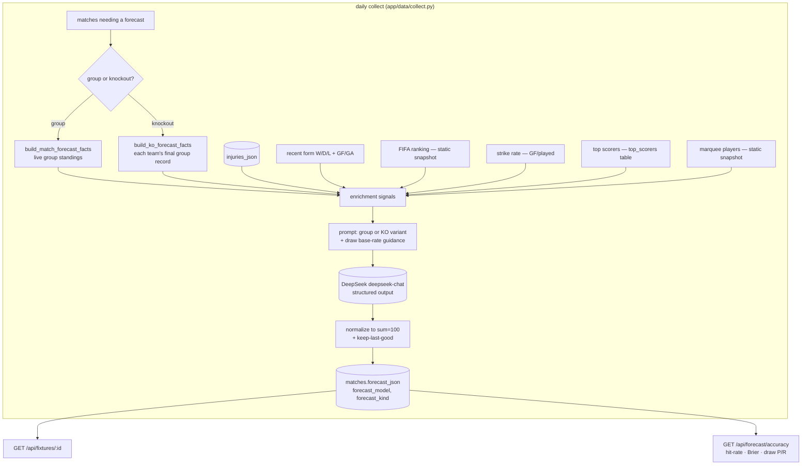

# Forecast Algorithm

How the platform produces a pre-kickoff win/draw/win forecast for each match, what feeds it,
how it's stored, and how its accuracy is measured.

## Overview

Each match gets a **1X2 forecast** — `home_pct` / `draw_pct` / `away_pct` (summing to 100) plus
3–5 plain-language **factors** explaining the lean. Forecasts are produced by an LLM
(DeepSeek `deepseek-chat`) given a compact, deterministic **fact bundle** built from tournament
data. The LLM does the reasoning; all numeric facts are computed in Python, never invented.

Two flavours share one pipeline:
- **Group stage** — grounded in the live group table.
- **Knockout** — grounded in each team's *final group record* (knockouts have no group table).

## Data flow

## The model

- **DeepSeek `deepseek-chat`**, temperature 0.7, called via LangChain **structured output** so the
  reply is a typed `MatchForecast` object, not free text. (`app/llm/deepseek.py`, `app/pipeline/forecast.py`)
- Output schema: `home_pct`, `draw_pct`, `away_pct` (ints), and `factors: [{name, lean, why}]`.
- **Guardrail:** the prompt requires every factor to cite a fact present in the input JSON — no
  invented xG, venues, head-to-head, or rest days. Enrichment signals are the *only* way new
  information enters.

## Inputs

### Base facts
- **Group match** (`build_match_forecast_facts`): both teams' rows from the shared group table —
  position, points, played, W/D/L, goals for/against, goal difference, qualification status.
- **Knockout match** (`build_ko_forecast_facts`): each team's **final group-stage record** resolved by
  searching across all groups (knockouts carry no `group_name`). If either team's row can't be
  resolved, the match is skipped gracefully — no fabricated forecast.

### Enrichment signals (`app/pipeline/forecast_signals.py`)
Attached to both group and KO fact bundles under a `signals` key. **Every signal is optional** —
omitted when its source is absent, never fabricated (preserving the cite-a-fact guardrail).

| Signal | Source | Notes |
|--------|--------|-------|
| **FIFA ranking** | `app/data/fifa_rankings.py` | Static pre-tournament snapshot (48 teams). Strongest prior, especially for knockouts. |
| **Strike rate** | standings GF / played | Goals-per-game; sharpened by top-scorer goals. |
| **Recent form** | finished matches | Last results as W/D/L + goals for/against. |
| **Injuries & suspensions** | `matches.injuries_json` | Surfaces unavailable key players; **both** injury and suspension rows count as unavailable. |
| **Top scorers** | `top_scorers` table | Per-team tournament scorers (goals so far). |
| **Marquee players** | `app/data/marquee_players.py` | Reputation-based standouts — surfaces elite names (e.g. a famous striker in a goal drought) that the goal-based top-scorers signal would miss. |

## Prompts (`app/pipeline/prompts.py`)

- **Group prompt** — predicts the 1X2 result from standings + signals.
- **Knockout prompt** — predicts the **90-minute** result (a 90-min draw → extra time / penalties),
  notes a higher draw probability than an equivalent group game, and asks for an explicit
  "who advances" factor.
- **Draw guidance (both)** — instructs the model that ~25–28% of matches end in a draw and not to
  under-predict draws or over-commit to a favourite in evenly-matched games. This corrected a prior
  bias where draws were predicted ~12% of the time vs ~27% actual.

## Normalization & keep-last-good

- `_normalize_pcts` clamps the three percentages to non-negative and forces them to sum to 100; an
  all-zero reply defaults to `34/33/33`.
- Generation retries twice on failure. **Keep-last-good:** a failed or empty generation never
  overwrites an existing stored forecast.

## When forecasts are generated

1. **Daily collect** — `app/pipeline/scheduler_entry.py` → `run_pipeline` → `collect.run(date)` →
   `backfill_forecasts`. A TZ guard runs it once per day (~07:00 Melbourne). Only forecasts matches
   that lack one (keep-last-good).
2. **Manual dated collect** — `python -m app.data.collect --date YYYY-MM-DD`.
3. **On-demand refresh** — `python -m app.data.collect --refresh-upcoming-forecasts`. Loads from the
   DB only (no API-Football calls), **force-regenerates every not-yet-played match** with the current
   model (e.g. after a model/signal change). Played matches are never touched; keep-last-good still
   protects against a failed call blanking a forecast.

## Storage

On the `matches` table:
- `forecast_json` — the `MatchForecast` blob (percentages + factors).
- `forecast_model` — `deepseek-chat`.
- `forecast_kind` — `group` | `ko` | null (distinguishes the pipeline; null = no forecast).

Exposed via `GET /api/fixtures/{id}`.

## Accuracy measurement

`GET /api/forecast/accuracy?days=<n>&stage=<group|ko>` (`app/api/forecast_accuracy.py`) computes,
over finished matches with a forecast:
- **Hit rate** — argmax(forecast) vs actual result (the canonical `forecast_correct` rule).
- **Brier score** — mean over matches of the summed squared error across the three outcomes
  (range 0–2; lower is better; uniform 33/33/33 ≈ 0.67).
- **Draw precision / recall** — how well draws specifically are called.

Filters: `days` limits to recent kickoffs; `stage=group` (has `group_name`) vs `stage=ko`
(no `group_name`). Empty scope returns zeros gracefully.

## Known limitations

- **FIFA ranking and marquee-player maps are static manual snapshots** — they don't track live
  ranking changes or call-ups; refresh them periodically.
- **Knockout accuracy and draw-recall gains are measurable only after matches are played** — use the
  accuracy endpoint once results land.
- The model is an LLM estimate grounded in supplied facts; it is not a fitted statistical model
  (the single-tournament sample is too small to fit one reliably).
