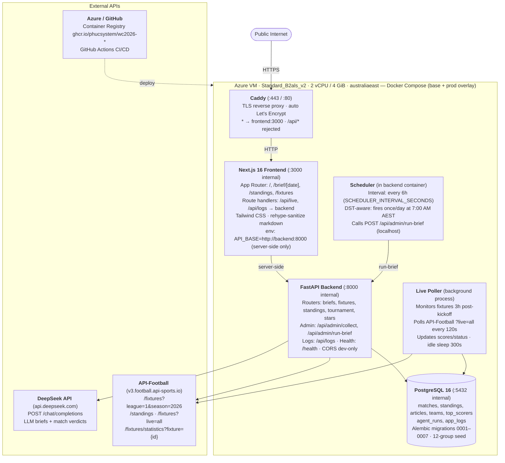
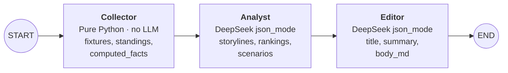
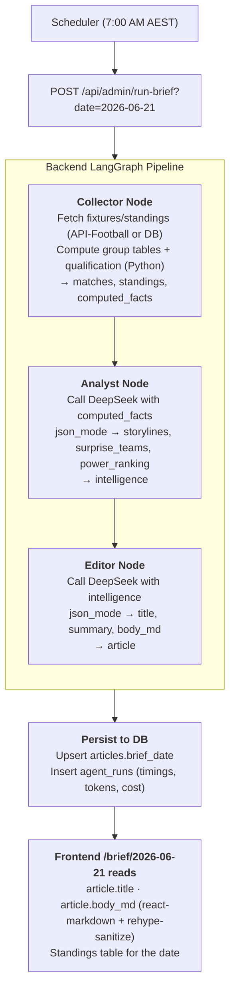
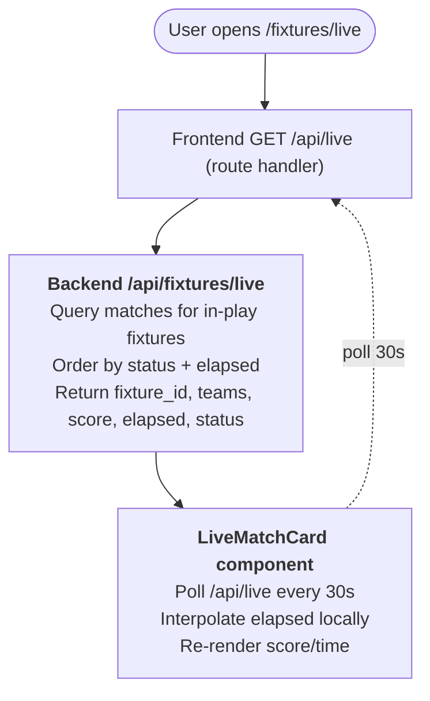
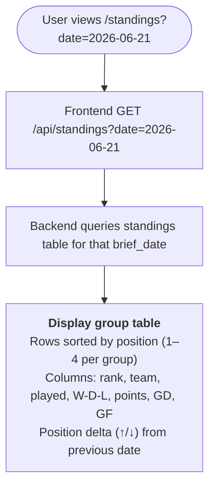
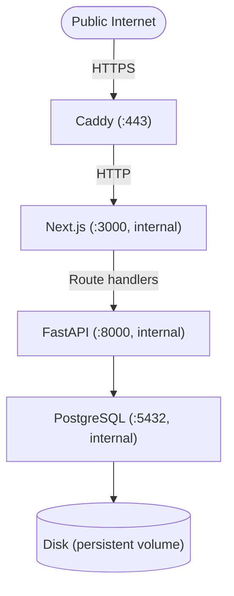

# System Architecture

**Project:** World Cup 2026 Intelligence  
**Scope:** High-level component diagram, data flow, and API surface  
**Reference:** `docs/diagrams/architecture.svg` (see also: `architecture.drawio` for edits)

---

## 1. Architecture Diagram



---

## 2. Component Overview

### 2.1 Next.js Frontend

**Role:** Server-side-rendered (SSR) dashboard; users see fresh data on every page load.

**Key features:**
- **Server components** (default): fetch from FastAPI backend at render time
- **Client components** (islands): `LiveMatchCard` (30s poll), `LogsView` (live search/pagination)
- **Route handlers:** `/api/live` and `/api/logs` are same-origin proxies (backend URL never exposed)
- **Styling:** Tailwind CSS v4 + custom CSS properties (design tokens from `UI_SPEC.md`)
- **Markdown rendering:** react-markdown + rehype-sanitize for XSS safety
- **Time handling:** Australia/Melbourne timezone anchored; hydration-safe fallbacks

**Endpoints consumed:**
```
GET /api/briefs                          # List all briefs (date, title, summary)
GET /api/briefs/latest                   # Latest brief
GET /api/briefs/{date}                   # Specific date
GET /api/fixtures/upcoming               # Upcoming matches
GET /api/fixtures/live                   # Live match updates
GET /api/fixtures/knockout               # Knockout-stage preview
GET /api/fixtures/{fixture_id}           # Match detail + events, statistics, verdict
GET /api/standings?date={YYYY-MM-DD}     # Group standings on a date
GET /api/standings/trend?team=&window=   # Position deltas over window
GET /api/tournament/summary               # Qualification & bracket state
GET /api/stars                           # Top scorers, assists
GET /api/logs                            # App logs (filters: level, q, source)
GET /health                              # Backend healthcheck
```

---

### 2.2 FastAPI Backend

**Role:** RESTful API serving match data, standings, briefs, and operational logs.

**Stack:**
- FastAPI >=0.115, uvicorn (ASGI server)
- SQLAlchemy 2.0 **Core** (raw SQL, not ORM)
- Pydantic v2 (request/response models, settings)
- httpx (async HTTP client for external APIs)

**Key routers:**

| Router | File | Endpoints |
|--------|------|-----------|
| briefs | `api/briefs.py` | GET /api/briefs, /latest, /{date} |
| standings | `api/standings.py` | GET /api/standings?date, /trend?team&window |
| fixtures | `api/fixtures.py` | GET /api/fixtures/{upcoming,live,knockout,{id}} |
| tournament | `api/tournament.py` | GET /api/tournament/summary |
| stars | `api/fixtures.py` | GET /api/stars |
| logs | `api/logs.py` | GET /api/logs (filter + pagination) |
| admin | `api/admin.py` | POST /api/admin/{collect,run-brief} (LOCAL ONLY) |
| main | `main.py` | GET /health, exception handling, CORS |

**Request/Response:** All responses are JSON; Pydantic models validate at boundary.

---

### 2.3 Pipeline (LangGraph)

**Role:** Deterministic + LLM-driven intelligence generation.

**File:** `backend/app/pipeline/graph.py` (StateGraph)

**Nodes:**

1. **Collector** (`nodes_collector.py`)
   - **Input:** brief_date
   - **Function:** Pure Python, no LLM
     - Fetch fixtures + standings from API-Football (or load from DB)
     - Compute group tables (3/1/0 pts, tiebreak GD→GF)
     - Compute best-thirds qualification (8 teams from 12 groups)
     - Compute stake groups (Q, E, E-and-R)
     - Build recent results + upcoming fixtures
   - **Output:** matches, standings, computed_facts
   - **Idempotent:** Upserts to DB; safe to retry

2. **Analyst** (`nodes_analyst.py`)
   - **Input:** computed_facts from Collector
   - **LLM:** DeepSeek (json_mode, temp 0.7, 3 retries w/ exponential backoff)
   - **Output:** JSON object with:
     - `storylines`: Key emerging narratives
     - `surprise_teams`: Underperformers + overperformers
     - `power_ranking`: Top contenders
     - `qualification_narrative`: Path to advancement
     - `fixture_stakes`: Next match impact
     - `group_scenarios`: Possible outcomes
   - **Constraints:** Cites ONLY pre-computed numbers; no invented stats

3. **Editor** (`nodes_editor.py`)
   - **Input:** intelligence from Analyst
   - **LLM:** DeepSeek (json_mode, temp 0.7, 3 retries)
   - **Output:** JSON object with:
     - `title`: Brief headline
     - `summary`: 2-line summary
     - `body_md`: Full markdown article
   - **Constraints:** Markdown references must cite internal fixtures/standings tables

**State:** BriefState TypedDict
```python
brief_date: str                  # YYYY-MM-DD
matches: list[MatchData]         # Raw fixture data
standings: dict[str, GroupTable] # Group standings
computed_facts: dict             # Collector output
intelligence: dict               # Analyst output
article: dict                    # Editor output
run_id: str                      # UUID
node_timings: dict               # Execution times
tokens_in: int                   # DeepSeek input tokens
tokens_out: int                  # DeepSeek output tokens
cost_usd: float                  # Total API cost
error: str | None                # Error message if failed
```

**Execution:**



**Persistence:** On success, insert into `articles` table (upsert on brief_date); also persist to `agent_runs` (timing, tokens, cost).

**Per-Match Verdicts:** As a separate operation (not part of the daily brief pipeline), the daily collect also:
- Fetches API-Football statistics (possession, shots, xG, corners) once per finished match (guarded to avoid re-fetching)
- Generates a 1-2 sentence per-match verdict via `backend/app/pipeline/verdict.py` using DeepSeek (skipped if no DEEPSEEK_API_KEY)
- Stores both in `matches.statistics_json` and `matches.verdict_text` / `matches.verdict_model` (keep-last-good strategy: failed generations never overwrite)
- Frontend renders these on `/match/[fixture_id]` when present

---

### 2.4 Data Collection (Backend)

**Role:** Fetch and parse world cup data; compute standings deterministically.

**Key modules:**

| Module | File | Purpose |
|--------|------|---------|
| `api_football.py` | data/ | APIFootballClient + pure parsers; includes `/fixtures/statistics` call |
| `standings_math.py` | data/ | Pure functions: group tables, H2H, best-thirds, qualification |
| `collect.py` | data/ | CLI: fetch → assign → compute → upsert DB; includes `backfill_finished_statistics` and `backfill_finished_verdicts` |
| `repository.py` | data/ | SQLAlchemy Core upserts (matches, standings, teams) |
| `deepseek.py` | data/ | ChatOpenAI wrapper, cost/token tracking |
| `verdict.py` | pipeline/ | Per-match verdict generation: builds fact bundle (score, scorers, standings) + LLM call (DeepSeek) |

**Standings Math (Pure Functions):**
- `compute_group_table(matches: list[Match]) -> list[TeamRow]` — 3/1/0 pts, GD, GF
- `rank_best_thirds(groups: dict[str, list[TeamRow]]) -> list[TeamRow]` — 8 teams qualify
- `qualification_status(groups, best_thirds) -> dict[str, str]` — per-team status
- `group_scenarios(group, remaining_matches) -> list[dict]` — possible outcomes
- `tournament_summary(groups, best_thirds, top_scorers) -> dict` — overall snapshot

**API-Football Quirk:** Standings endpoint returns 12 real groups + 1 aggregate "Group Stage" row (which sums all teams' stats). Collector rejects the aggregate row.

**Graceful Degradation:** If API key missing or network fails, log warning + proceed with DB data rather than crashing.

---

### 2.5 Scheduler

**Role:** Trigger brief generation on a fixed schedule.

**File:** `backend/app/pipeline/scheduler_entry.py`

**Logic:**
- APScheduler (background job)
- Interval: Every SCHEDULER_INTERVAL_SECONDS (default 6h)
- DST guard: Only fires if current time hour matches target hour (7:00 AM AEST) and last run was >20h ago
- Calls: POST `/api/admin/run-brief?date={today in BRIEF_TIMEZONE}` (internal HTTP)

**Example:** SCHEDULER_INTERVAL_SECONDS=21600 (6h) → cron fires 4x daily, but only runs brief once/day (7 AM).

---

### 2.6 Live Poller

**Role:** Update match scores in real-time during in-play fixtures.

**File:** `backend/app/pipeline/live_poller.py`

**Logic:**
- Background process (separate from scheduler)
- Every LIVE_POLL_SECONDS (120s), fetch `/fixtures?live=all` from API-Football
- For each live fixture, update score/status/elapsed in DB
- Only polls if a match is within LIVE_WINDOW_HOURS (3h post-kickoff)
- Otherwise, sleeps IDLE_SLEEP_SECONDS (300s) between checks

**UI:** Frontend calls `/api/fixtures/live` which reads latest DB rows; client interpolates seconds locally.

---

### 2.7 Database (PostgreSQL 16)

**Tables:**

| Table | Columns | Purpose |
|-------|---------|---------|
| `matches` | id, fixture_id, league, season, date, home_team_id, away_team_id, home_goals, away_goals, status, elapsed, timezone, events_json, statistics_json, verdict_text, verdict_model | Raw fixture data + enrichments (upserted nightly) |
| `standings` | id, brief_date, group_name, position, team_id, played, wins, draws, losses, points, goal_diff, goals_for | Snapshot standings per date (upserted) |
| `articles` | id, brief_date (unique), intelligence (JSONB), article (JSONB), created_at | Generated briefs (upserted) |
| `teams` | id, team_id, name, country_code, flag_url | Dim table (seeded) |
| `top_scorers` | id, season, player_name, team_id, goals, assists | Updated nightly |
| `agent_runs` | id, run_id (UUID), brief_date, node_timings (JSONB), tokens_in, tokens_out, cost_usd, status, error, created_at | Pipeline execution metadata |
| `app_logs` | id, ts (desc index), level, source, message, context (JSONB), run_id, created_at | Application logs (INFO+, 14-day retention) |

**Migrations:** Alembic (0001–0007) manage schema; `migrate` container runs on first boot.

**Indexes:** Desc index on `app_logs.ts`; unique on `articles.brief_date`.

---

## 3. Data Flow

### 3.1 Daily Brief Generation



### 3.2 Live Match Tracking



### 3.3 Standings Query



---

## 4. Configuration and Secrets

**Config source:** `backend/app/config.py` (pydantic-settings)

| Env Var | Default | Purpose |
|---------|---------|---------|
| `DATABASE_URL` | `postgresql+psycopg://wc:wc@localhost:5432/worldcup` | Postgres connection string |
| `API_FOOTBALL_KEY` | (None) | API-Football API key (optional; demo without it) |
| `API_FOOTBALL_BASE_URL` | `https://v3.football.api-sports.io` | API endpoint |
| `API_FOOTBALL_LEAGUE` | 1 | FIFA World Cup league ID |
| `API_FOOTBALL_SEASON` | 2026 | Target season (use 2022 for free-plan demo) |
| `DEEPSEEK_API_KEY` | (None) | DeepSeek API key (required for LLM briefs) |
| `BRIEF_TIMEZONE` | `Australia/Melbourne` | Timezone for scheduling + UI display |
| `LIVE_POLL_SECONDS` | 120 | Live poller interval (seconds) |
| `IDLE_SLEEP_SECONDS` | 300 | Live poller idle sleep (seconds) |
| `LIVE_WINDOW_HOURS` | 3 | Hours post-kickoff to consider "in-play" |
| `LOG_RETENTION_DAYS` | 14 | App logs cleanup threshold |
| `LOG_DB_ENABLED` | true | Persist logs to DB (false in tests) |

**Secrets handling:** API keys live in the VM `.env` (git-ignored); never committed.

---

## 5. Deployment Topology



**Port Exposure:**
- **Public:** Caddy `:443` (TLS) and `:80` (HTTP→HTTPS redirect) only
- **Internal:** Backend (`:8000`), Postgres (`:5432`), Frontend (`:3000`)
- **NSG (Azure):** Inbound rules: 80/443 (any), 22 (SSH, JIT-opened during deploy)

---

## 6. Monitoring and Observability

**Application logs:** `app_logs` table
- Queries: `SELECT * FROM app_logs WHERE ts > NOW() - INTERVAL '1 hour' ORDER BY ts DESC`
- UI: GET `/api/logs?level=ERROR&limit=50` (available in dashboard)

**Pipeline metrics:** `agent_runs` table
- Columns: run_id, brief_date, tokens_in/out, cost_usd, node_timings, status, error
- Used to track cost trends and identify bottlenecks

**Health check:** GET `/health` → `{"status": "ok"}` (always 200)

**No external monitoring yet:** APM (e.g., DataDog) is out of V1 scope.

---

## 7. Known Limitations

- **No GraphQL:** REST API only.
- **No WebSocket:** Live updates via polling (30s from client).
- **No caching layer:** Redis deferred; DB queries are simple enough.
- **No async database:** psycopg3 used in synchronous mode (FastAPI is async, but SQL is blocked on thread pool).
- **No request tracing:** Correlation IDs not implemented; can add via middleware.

---

## 8. References

- **Deployment:** `docs/deployment.md` (full runbook)
- **Code standards:** `docs/code-standards.md` (Python/TypeScript conventions)
- **UI specification:** `docs/UI_SPEC.md` (design system, screens)
- **Project overview:** `docs/project-overview-pdr.md` (product decisions)
